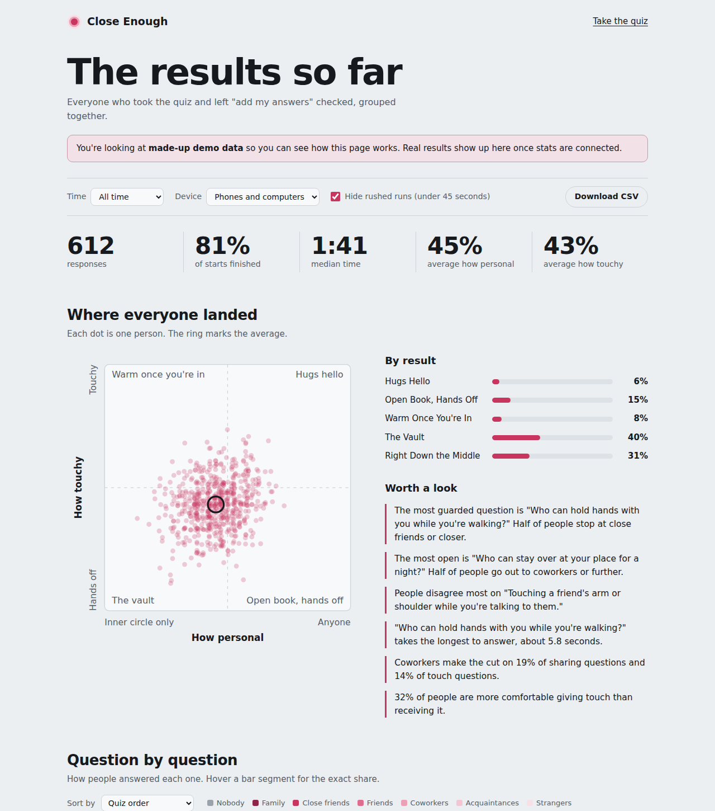

# Close Enough

A 20-question quiz about two things: how far your circle of closeness reaches, and how touchy you are. You end up as a dot on a chart, with a picture you can share. There's also a stats page that shows how everyone who's taken it answered.

- **Quiz:** `index.html`
- **Stats:** `dashboard.html` (add `?demo=1` to the address to see it with made-up data)
- **How the scoring works:** [METHODOLOGY.md](METHODOLOGY.md)



## What's in here

| File | What it is |
|---|---|
| `index.html` | The quiz, results page and share pictures |
| `dashboard.html` | The stats page |
| `quiz-core.js` | The questions, the rings, the scoring math, and the small bit of code that saves and reads results. Both pages use it. |
| `config.js` | Where your database address and key go. Empty means the quiz works but saves nothing. |
| `commentary.md` | Your notes. Whatever you write shows up on the stats page. |
| `supabase/schema.sql` | Sets up the database tables. Run it once. |
| `.github/workflows/keep-awake.yml` and `scripts/keep-awake.js` | Pings the database every 3 days so the free plan doesn't pause it |
| `tests/scoring.test.js` | Checks the scoring math. Run `node --test` from this folder. |
| `METHODOLOGY.md` | The scoring, explained without code |
| `og-image.png` | The preview picture when someone pastes the link into a chat |

No build step, no framework. It's plain HTML, CSS and JavaScript.

## Try it on your computer

Opening `index.html` straight from your files works for the quiz. The stats page reads `commentary.md` over the network, so for that one, run a tiny local server from this folder:

```
python3 -m http.server 8000
```

Then go to `http://localhost:8000` and `http://localhost:8000/dashboard.html?demo=1`.

## Put it online (GitHub Pages)

1. Make a new public repository on GitHub, for example `close-enough`, and upload everything in this folder.
2. In the repository, go to **Settings > Pages**. Under "Build and deployment", pick **Deploy from a branch**, choose `main` and `/ (root)`, and save.
3. After a minute or two it's live at `https://<your-username>.github.io/close-enough/`.
4. Open `index.html` and change the `og:image` line near the top to the full address of `og-image.png`, so link previews show the picture.

**Using your own domain.** If you point a domain at your main GitHub Pages site (the `<your-username>.github.io` repository), every other Pages repository shows up under it. So with `sejulphanord.com` set up there, this quiz would live at `sejulphanord.com/close-enough/` with no extra setup.

## Turn on stats (Supabase)

The quiz saves results to a free Supabase database. It takes about ten minutes.

1. Make an account at [supabase.com](https://supabase.com) and create a new project. Any region is fine. Save the database password somewhere, though you won't need it for this.
2. In the project, open **SQL Editor**, click **New query**, paste in everything from `supabase/schema.sql`, and click **Run**. It should say "Success. No rows returned."
3. Go to **Project Settings > API Keys**. Copy the **Project URL** and the **publishable key** (it starts with `sb_publishable_`). Older projects call it the `anon` key, which also works.
4. Paste both into `config.js`:

   ```js
   window.CLOSE_ENOUGH_CONFIG = {
     supabaseUrl: 'https://abcdefgh.supabase.co',
     supabaseKey: 'sb_publishable_...',
     collectByDefault: true
   };
   ```

5. Upload the updated `config.js` to GitHub. Take the quiz once and your result should appear on the stats page.

The publishable key is meant to be public, and the database rules in `schema.sql` only let the public add rows and read them. Never put the **secret** key (or the old `service_role` key) in `config.js`.

Once stats are on, the start screen shows an "Add my answers to the anonymous group stats" checkbox with a "What gets saved?" link, and the results page links to the stats page.

## What gets saved

Only when the checkbox is checked:

- the 20 answers and the scores they add up to
- how long the quiz took, overall and per question
- phone or computer
- when it was finished
- the tag from the link they used, if it had one (see "Sharing links with tags")
- whether it's their first time finishing on that device
- a few activity counts: quiz started, share window opened, picture downloaded (these give the finish rate)

No names, emails, locations, cookies or accounts. To mark retakes, the browser keeps a count of how many times it has finished the quiz. That count stays on the person's device and never identifies them. Supabase keeps short-lived server logs like any web host.

Set `collectByDefault: false` in `config.js` if you'd rather people opt in than opt out. Since the site is public, it's worth adding a proper privacy policy page too. The "What gets saved?" window describes what the code does, but it isn't a legal policy.

## Sharing links with tags

Add `?ref=` and a short tag to the end of the link, and every response from that link is labeled with it:

```
https://sejulphanord.com/close-enough/?ref=instagram
https://sejulphanord.com/close-enough/?ref=linkedin
https://sejulphanord.com/close-enough/?ref=whatsapp
```

Tags can use lowercase letters, numbers, `-` and `_`, up to 30 characters. Anything else is ignored and the response counts as "No tag". Use a different tag for each place you post, and keep the spelling consistent, since `ig` and `instagram` show up as two separate sources.

The stats page gets a **Source** filter and a **Where people came from** table comparing each tag's average scores. Sources with fewer than 20 responses are marked as rough.

## Retakes

The first time someone finishes on a device, the response is saved as attempt 1. If they retake it on the same browser, it's saved as attempt 2, and so on. The stats page has a **First tries only** filter, on by default, so each person counts once.

It's a best effort. Someone who retakes it in a private window or on a different device looks like a new person.

## Keeping the database awake

Free Supabase projects pause after a week with no activity. While paused, results aren't saved, and the quiz doesn't show an error, so you'd only notice later.

The included GitHub Action handles this. Once the folder is on GitHub, it runs every 3 days on its own, reads the address and key from `config.js`, and asks the database for its latest response. There's nothing to set up.

- To check it's working, open the **Actions** tab, pick **Keep database awake**, and click **Run workflow**. A green check means the database answered.
- If the database is already paused, the run fails and GitHub emails you. Restore the project from the Supabase dashboard.
- GitHub turns off scheduled workflows in repositories that have had no commits for 60 days. It emails a warning first, and one click keeps it running.

## The stats page

`dashboard.html` shows:

- total responses, finish rate, median time, and the average of each score
- every result as a dot on the chart, and how many people landed in each corner
- a few automatic observations (most guarded question, most open, most split, slowest, and so on) once there are 20 or more responses
- every question's full spread of answers, sortable by most open, most guarded, most split or slowest
- who gets in, ring by ring, for sharing and for touch
- responses per day and a rolling average of both scores over time
- how long people took, the slowest questions, and phones vs. computers
- where people came from, by link tag
- filters for time range, device and source, switches for first tries only and hiding rushed runs, and a CSV download of everything for your own analysis

Your notes from `commentary.md` show up in a "Notes" section near the top.

**Want it private?** Delete the two "read" policies at the bottom of `schema.sql` (the comment there shows how), then view the data in Supabase's Table editor instead. The public stats page will stop loading.

## Changing the questions

Questions live in `quiz-core.js`. Each one has an `id` (like `s_cry`) that the saved results use, so:

- **Rewording** a question without changing what it asks: edit `q` and keep the `id`.
- **Replacing** a question with a different one: give it a new `id`, and change `VERSION` at the top (for example from `v1` to `v2`), so old and new results can be told apart.

Run `node --test` afterward to make sure the scoring still adds up.

## Known limits

- Anyone who finds the database address could add junk rows. The database rejects badly shaped data, but it can't tell a real person from a script. If that becomes a problem, the next step is a small Supabase Edge Function with a captcha in front of it.
- Retakes on the same browser are marked, but retakes in a private window or on another device aren't.
- The people who take it are whoever you share it with, so the numbers describe them, not people in general.

## License

MIT. See [LICENSE](LICENSE).
